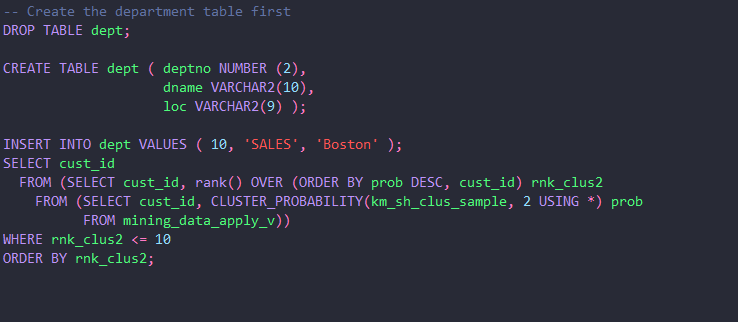

# Dracula for [Oracle SQL Developer](https://www.oracle.com/database/technologies/appdev/sql-developer.html)

> A dark theme for [Oracle SQL Developer](https://www.oracle.com/database/technologies/appdev/sql-developer.html).

## Install

All instructions can be found at [draculatheme.com/oracle-sql-developer](https://draculatheme.com/oracle-sql-developer).

## Team

This theme is maintained by the following person(s) and a bunch of [awesome contributors](https://github.com/dracula/oracle-sql-developer/graphs/contributors).

 |
--- |
[A Percova](https://github.com/apercova) |

## License

[MIT License](./LICENSE)